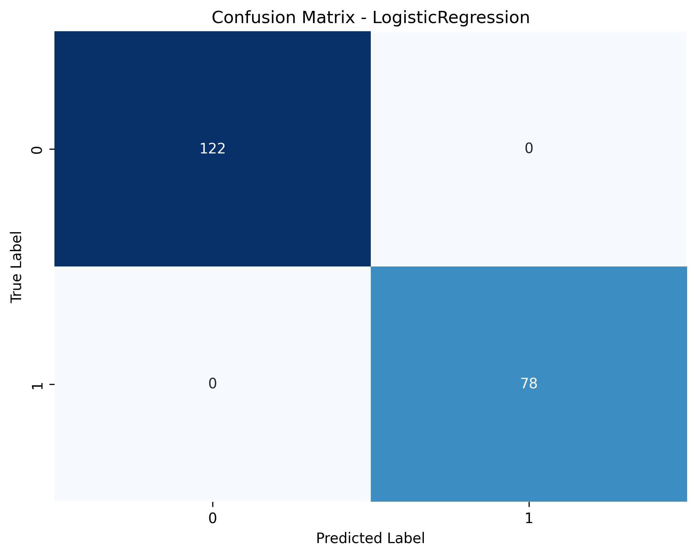
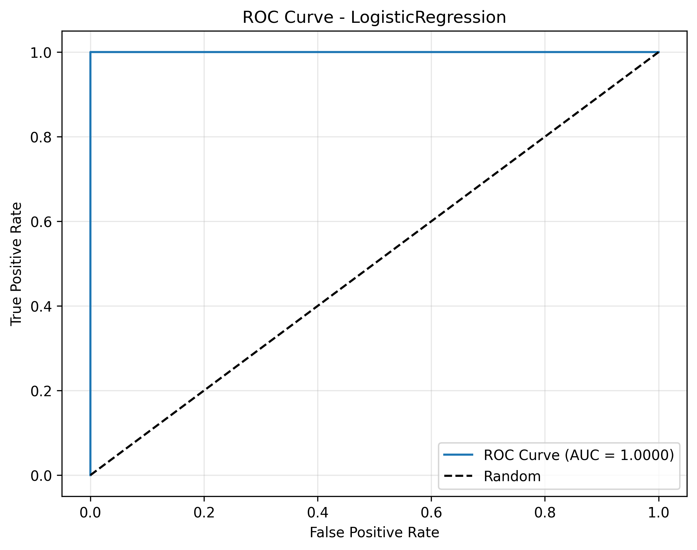
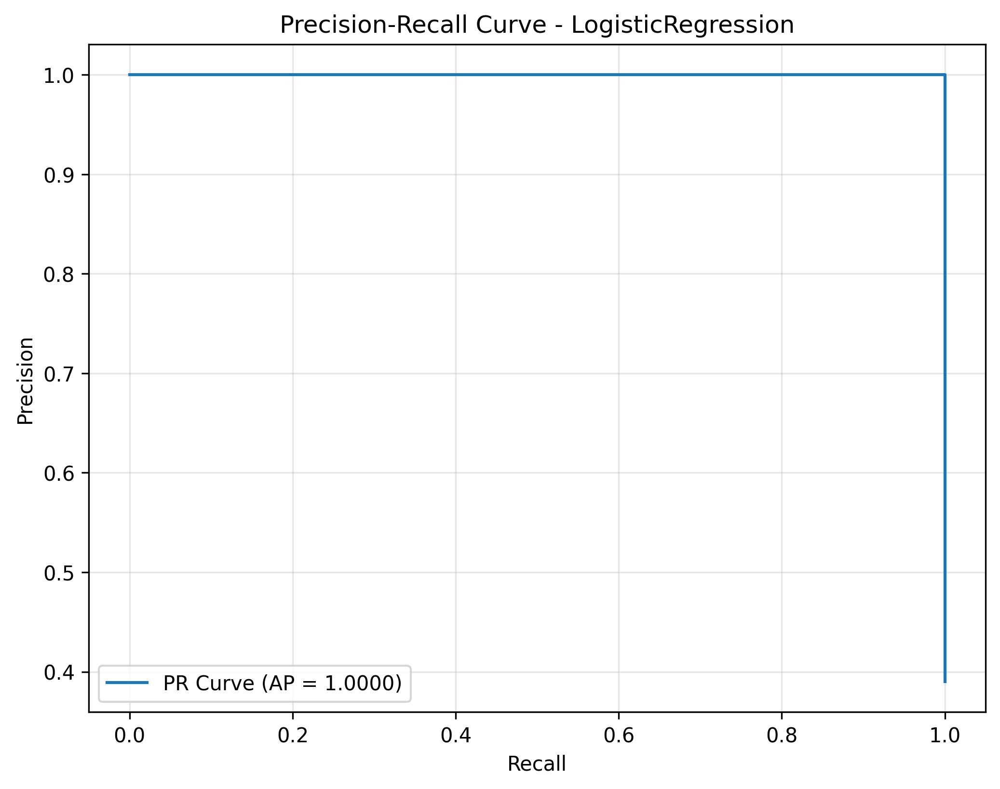
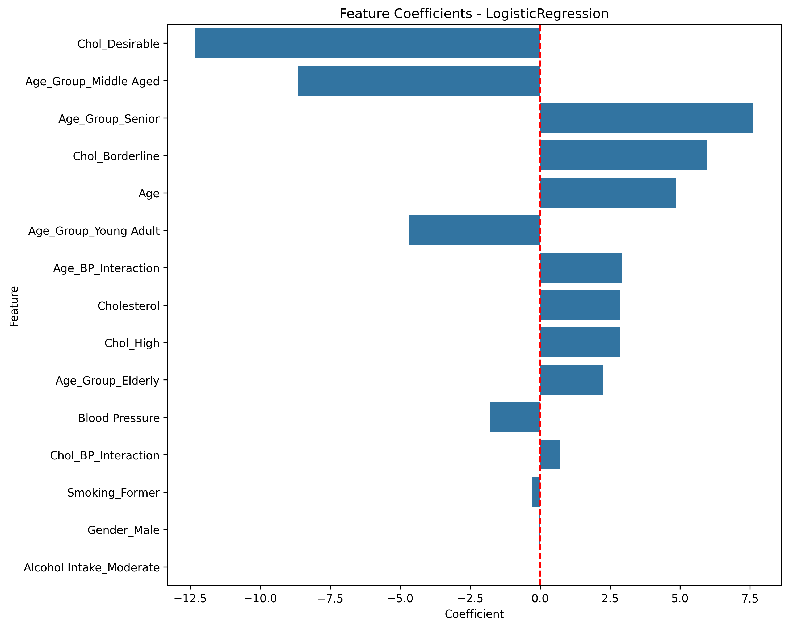

# LogisticRegression Model Evaluation Report

Generated on: 2025-03-27 20:12:50

## Model Performance Metrics

* **Accuracy**: 1.0000
* **Precision**: 1.0000
* **Recall**: 1.0000
* **F1 Score**: 1.0000
* **ROC-AUC**: 1.0000

## Confusion Matrix

## ROC Curve

## Precision-Recall Curve

## Top Feature Coefficients

| Feature | Coefficient |
|---------|-------------|
| Chol_Desirable | -12.3145 |
| Age_Group_Middle Aged | -8.6568 |
| Age_Group_Senior | 7.6175 |
| Chol_Borderline | 5.9530 |
| Age | 4.8421 |
| Age_Group_Young Adult | -4.6907 |
| Age_BP_Interaction | 2.9101 |
| Cholesterol | 2.8702 |
| Chol_High | 2.8669 |
| Age_Group_Elderly | 2.2355 |
