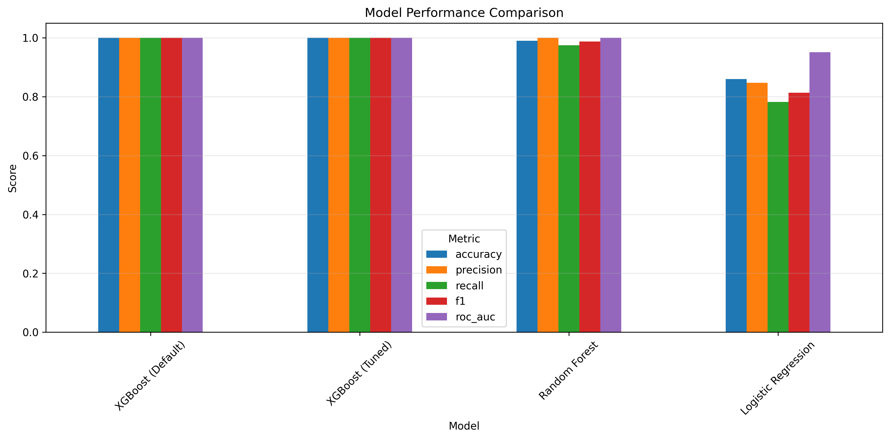
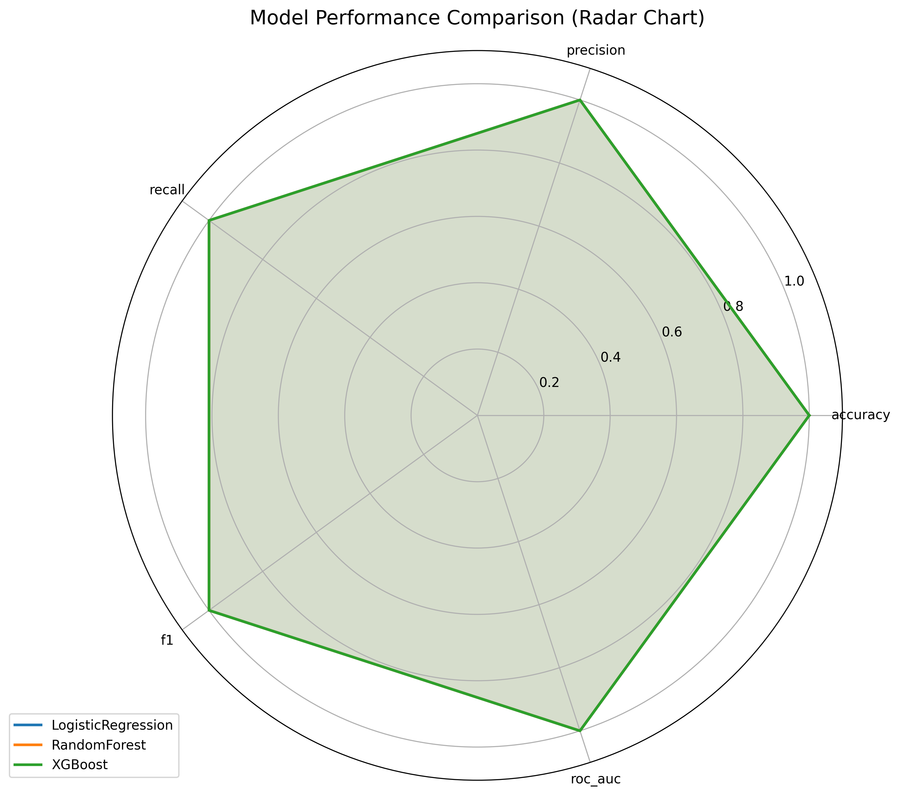

# Heart Disease Prediction - Model Comparison Report

Generated on: 2025-03-27 20:12:51

## Performance Metrics Comparison

| Model | Accuracy | Precision | Recall | F1 Score | ROC-AUC |
|-------|----------|-----------|--------|----------|--------|
| LogisticRegression | 1.0000 | 1.0000 | 1.0000 | 1.0000 | 1.0000 |
| RandomForest | 1.0000 | 1.0000 | 1.0000 | 1.0000 | 1.0000 |
| XGBoost | 1.0000 | 1.0000 | 1.0000 | 1.0000 | 1.0000 |

## Visual Comparison

## Best Model by Metric

* **Accuracy**: LogisticRegression (1.0000)
* **Precision**: LogisticRegression (1.0000)
* **Recall**: LogisticRegression (1.0000)
* **F1**: LogisticRegression (1.0000)
* **Roc_auc**: LogisticRegression (1.0000)

## Overall Recommendation

Based on the average performance across all metrics, the recommended model is **LogisticRegression**.
However, the final choice depends on specific application needs:
* For maximum accuracy (overall correctness): choose the model with highest accuracy
* To minimize false positives: prioritize precision
* To minimize false negatives (missing actual heart disease cases): prioritize recall
* For balanced performance: consider F1 score or ROC-AUC
