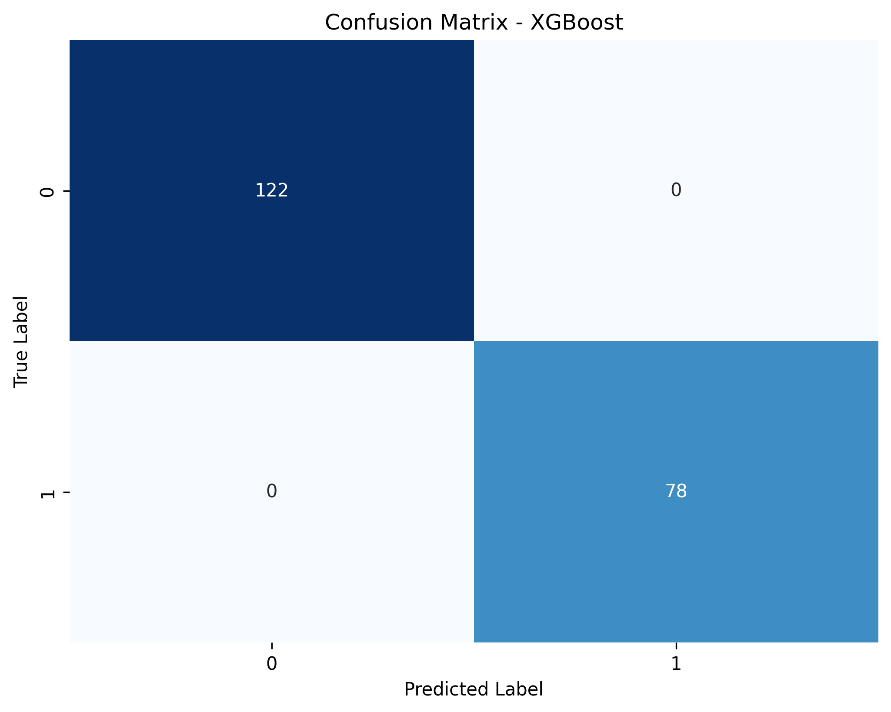
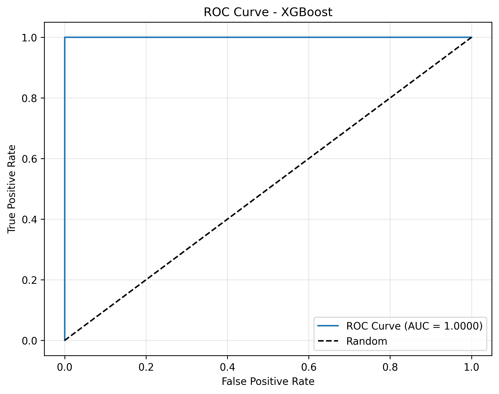
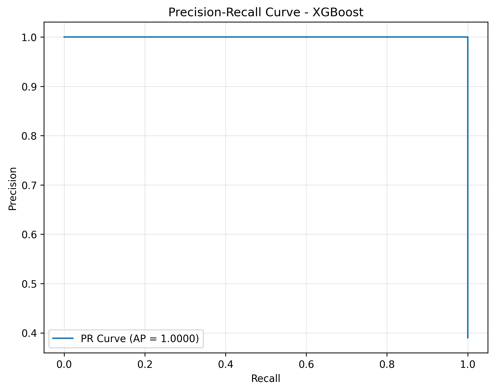
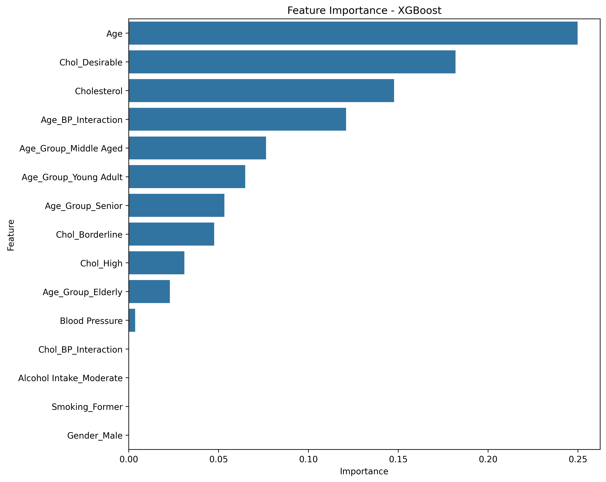

# XGBoost Model Evaluation Report

Generated on: 2025-03-27 20:12:50

## Model Performance Metrics

* **Accuracy**: 1.0000
* **Precision**: 1.0000
* **Recall**: 1.0000
* **F1 Score**: 1.0000
* **ROC-AUC**: 1.0000

## Confusion Matrix

## ROC Curve

## Precision-Recall Curve

## Top Feature Importances

| Feature | Importance |
|---------|------------|
| Age | 0.2498 |
| Chol_Desirable | 0.1819 |
| Cholesterol | 0.1477 |
| Age_BP_Interaction | 0.1210 |
| Age_Group_Middle Aged | 0.0765 |
| Age_Group_Young Adult | 0.0648 |
| Age_Group_Senior | 0.0533 |
| Chol_Borderline | 0.0476 |
| Chol_High | 0.0310 |
| Age_Group_Elderly | 0.0230 |
